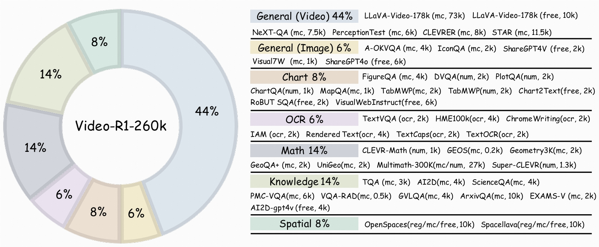
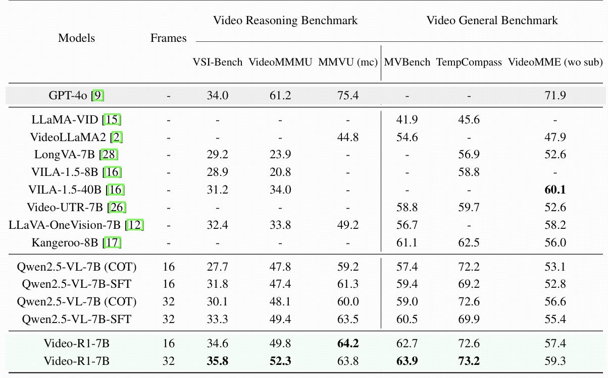
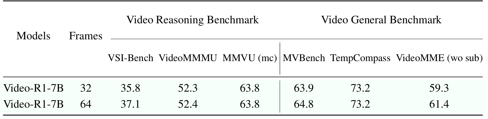
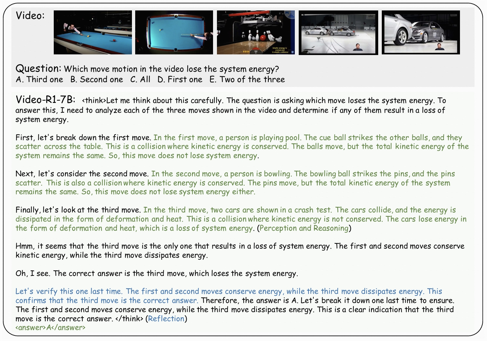
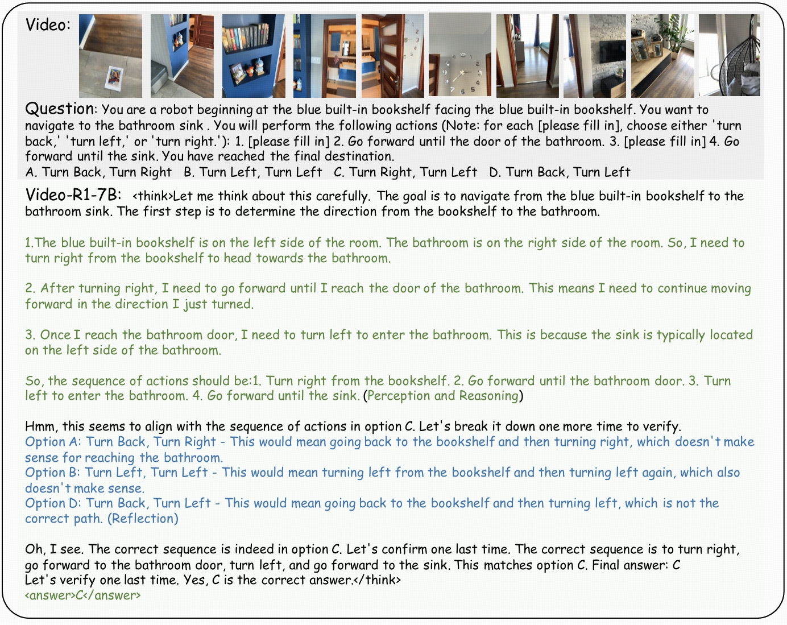
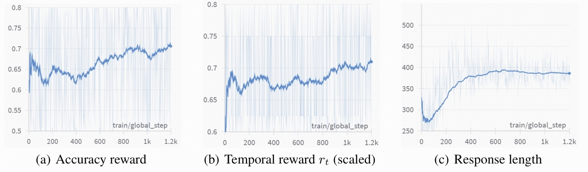

# Video-R1: Reinforcing Video Reasoning in MLLMs

[[📖 Paper](https://arxiv.org/pdf/2503.21776)] [[🤗 Video-R1-7B-model](https://huggingface.co/Video-R1/Video-R1-7B)] [[🤗 Video-R1-train-data](https://huggingface.co/datasets/Video-R1/Video-R1-data)] 
[[🤖 Video-R1-7B-model](https://modelscope.cn/models/Video-R1/Video-R1-7B)]  [[🤖 Video-R1-train-data](https://modelscope.cn/datasets/Video-R1/Video-R1-data)]


## 👀 About Video-R1

Inspired by DeepSeek-R1's success in eliciting reasoning abilities through rule-based RL, we introduce Video-R1 as **the first work to *systematically* explore the R1 paradigm for eliciting video reasoning** within MLLMs. 

We introduce T-GRPO, an extension of GRPO that incorporates temporal modeling to **explicitly promote temporal reasoning**. Besides, We constructed two datasets: **Video-R1-COT-165k** for SFT cold start and **Video-R1-260k** for RL training, both comprising image and video data.

Our Video-R1-7B obtain strong performance on several video reasoning benchmarks. For example, Video-R1-7B attains a 35.8% accuracy on video spatial reasoning benchmark VSI-bench, **surpassing the commercial proprietary model GPT-4o**.

Video-R1-7B **can be easily trained** using 4 H20 (96GB) GPUs, or 5 A100 (80G) GPUs.


## 🔥 News
- [2025/09/19] Our work is accepted by NeurIPS 2025.
- [2025/05/28] Our Video-R1-7B achieves **36.5%** accuracy on the new video reasoning benchmark [**Video-Holmes**](https://video-holmes.github.io/Page.github.io/), beating the commercial model **o4-mini (29.9%)** and **Gemini-2.0-Flash (30.6%)**.
- [2025/03/28] We release our paper, codes, model weights, and two curated training datasets in huggingface🤗 and modelscope🤖.
- [2025/02/23] We release the preliminary version of Video-R1, you can refer to `./previous_version` for this version.

## 📍 Features

+ Support Qwen2.5-VL
+ Support vLLM training and inference
+ Support Image-Video mixed training
+ Support multiple types for answers output (multiple choice, numerical, OCR, free-form, regression)
+ Provide full pipeline (dataset, COT annotation, SFT training, RL training, evaluation, etc) 

## 🔍 Dataset

 To overcome the scarcity of high-quality video reasoning training data, we strategically introduce image-based reasoning data as part of training data.  We collect data from a variety of public datasets and carefully sample and balance the proportion of each subset. 



To facilitate an effective SFT cold start, we leverage Qwen2.5-VL-72B  to generate COT rationales for the samples in Video-R1-260k. After applying basic rule-based filtering to remove low-quality or inconsistent outputs, we obtain a high-quality CoT dataset, Video-R1-COT 165k.

## 🏆 Performance



Video-R1 significantly outperforms previous models across most benchmarks. Notably, on VSI-Bench, which focuses on spatial reasoning in videos, Video-R1-7B achieves a new state-of-the-art accuracy of 35.8%, surpassing GPT-4o, a proprietary model, while using only 32 frames and 7B parameters. 

This highlights the necessity of explicit reasoning capability in solving video tasks, and confirms the effectiveness of reinforcement learning for video tasks.


<div align="center">
  
</div>

Besides, although the model is trained using only 16 frames, we find that evaluating on more frames (e.g., 64) generally leads to better performance, particularly on benchmarks with longer videos. These results indicate the importance of training models to reason over more frames.


## 🧠 Aha Moment in Video Reasoning

One of the most intriguing outcomes of reinforcement learning in Video-R1 is the emergence of self-reflection reasoning behaviors, commonly referred to as “aha moments”. Some examples are as follows.






## 📈 RL Training Curves

The accuracy reward exhibits a generally upward trend, indicating that the model continuously improves its ability to produce correct answers under RL.

Interestingly, the response length curve first drops at the beginning of RL training, then gradually increases. We guess this is because the model initially discards its previous, potentially sub-optimal reasoning style. Then gradually converges to a better and stable reasoning policy.




## 📚 Documentation

- **[完整使用指南](USAGE_GUIDE.md)**: 详细的环境安装、训练、评估、推理和工具使用说明
- **[快速开始指南](QUICKSTART.md)**: 5分钟快速上手指南
- **[配置说明](src/r1-v/config/README.md)**: Hydra配置系统使用说明
- **[消融研究](src/r1-v/ABLATION_STUDY_README.md)**: 消融研究工具使用
- **[推理优化](src/r1-v/INFERENCE_OPTIMIZATION_README.md)**: 推理优化工具使用
- **[LaTeX表格生成](src/r1-v/LATEX_TABLE_GENERATOR_README.md)**: 表格生成工具使用
- **[方法图生成](src/r1-v/METHOD_DIAGRAM_README.md)**: 图表生成工具使用

## 📐 Set up

```bash
git clone https://github.com/tulerfeng/Video-R1
cd Video-R1

# build environment
conda create -n video-r1 python=3.11 
conda activate video-r1
bash setup.sh

# qwen video extraction setting, e.g., max frames, resolutions
# Use the [decord] feature to improve speed
cd src/qwen-vl-utils
pip install -e .[decord]
cd ..

# download training dataset
git lfs install
git clone https://huggingface.co/datasets/Video-R1/Video-R1-data
```

Please put the downloaded dataset to `src/r1-v/Video-R1-data/`

Then, unzip the data

```
python ./src/unzip.py
```

The `Video-R1-260k.json` file is for RL training while `Video-R1-COT-165k.json` is for SFT cold start.

Qwen2.5-VL has been frequently updated in the Transformers library, which may cause version-related bugs or inconsistencies. Our code is compatible with the following version, please download at [here](https://drive.google.com/file/d/1Kc81WZitEhUZYWXpL6y2GXuSXufLSYcF/view?usp=sharing)

Then install our provided version of transformers

```bash
unzip transformers-main.zip
cd ./transformers-main
pip install .
```

For vLLM library, please use 0.7.2 version.

For trl library, please use 0.16.0 version.

## 🚀 Training

We first perform supervised fine-tuning on the Video-R1-COT-165k dataset for one epoch to obtain the Qwen2.5-VL-7B-SFT model. If you want to perform CoT annotation on your own data, please refer to `src/generate_cot_vllm.py`

```bash
bash ./src/scripts/run_sft_video.sh
```
If you want to skip the SFT process, we also provide one of our SFT models at [🤗Qwen2.5-VL-SFT](https://huggingface.co/Video-R1/Qwen2.5-VL-7B-COT-SFT). 

This is followed by RL training on the Video-R1-260k dataset to produce the final Video-R1 model. Due to current computational resource limitations, we train the model for only 1.2k RL steps.  

The script for training the obtained Qwen2.5-VL-7B-SFT model with T-GRPO or GRPO is as follows

```bash
bash ./src/scripts/run_grpo_video.sh
```

You can also use the following script to enable vLLM acceleration for RL training

```bash
bash ./src/scripts/run_grpo_vllm_qwen25vl.sh
```

For efficiency considerations, we limit the maximum number of video frames to 16 during training. Each frame is processed at a max resolution of 128 × 28 × 28.  You can set this in `src/qwen-vl-utils`

Please keep per_device_train_batch_size=1 as in previous work r1-v

## 🔮 Inference & Evaluation

During inference, we increase the max frame resolution to 256 × 28 × 28 and max frames to 16/32/64 to enhance performance. You can easily set this in `src/qwen-vl-utils`

For all evaluations, we follow the decoding configuration used in the official Qwen2.5-VL demo, with top\_p = 0.001 and temperature = 0.01. Setting large top_p may encounter messy output when inference.

We recommend using our provided json files and scripts for easier evaluation. 

The json files can be downloaded at: [[🤗 Video-R1-eval](https://huggingface.co/datasets/Video-R1/Video-R1-eval)], put them in `/src/r1-v/Evaluation` 

Next, download the evaluation video data from each benchmark’s official website, and place them in `/src/r1-v/Evaluation` as specified in the provided json files.

Finally, conduct evaluation on all benchmarks using the following scripts

```bash
bash ./src/eval_bench.sh
```
For infernce on a single example, you may use:

```bash
python ./src/inference_example.py
```

## Acknowledgements

We sincerely appreciate the contributions of the open-source community. The related projects are as follows: [R1-V](https://github.com/Deep-Agent/R1-V) , [DeepSeek-R1](https://github.com/deepseek-ai/DeepSeek-R1) 

## Citations

If you find our work helpful for your research, please consider citing our work.   

```
@article{feng2025video,
  title={Video-R1: Reinforcing Video Reasoning in MLLMs},
  author={Feng, Kaituo and Gong, Kaixiong and Li, Bohao and Guo, Zonghao and Wang, Yibing and Peng, Tianshuo and Wang, Benyou and Yue, Xiangyu},
  journal={arXiv preprint arXiv:2503.21776},
  year={2025}
}
```
